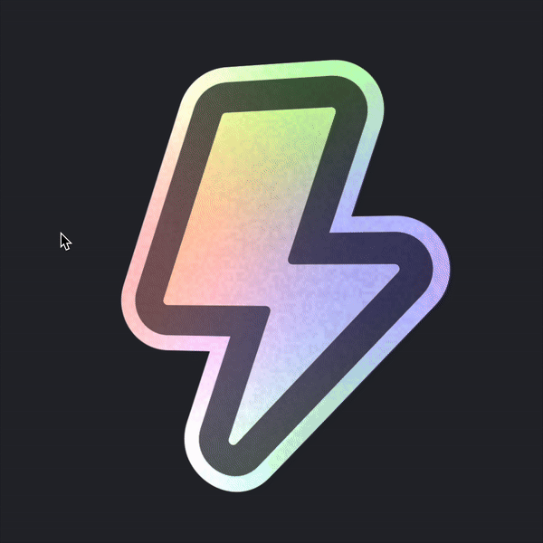

# Sticker

A Swift Package that uses Metal shaders to apply a Pokemon-style foil effect to a view.



# Installation

Add the following dependency to your `Package.swift` file:

```swift
dependencies: [
    .package(url: "https://github.com/bpisano/sticker", .upToNextMajor(from: "0.1.0"))
]
```

# Usage

Use the `.stickerEffect()` view modifier to apply the effect to any view.

```swift
import Sticker

struct ContentView: View {
    var body: some View {
        Image(.stickerIcon)
            .stickerEffect()
    }
}
```

By default, the effect is not animated.

## Parameters

The following modifiers are available to customize the sticker effect:

| Modifier | Default Value | Description |
|----------|---------------|-------------|
| `.stickerEffectScale(_:)` | 1.4 | Controls the overall scale of the effect pattern |
| `.stickerEffectIntensity(_:)` | 0.8 | Adjusts the strength of the holographic effect |
| `.stickerEffectContrast(_:)` | 0.9 | Modifies the contrast between light and dark areas |
| `.stickerEffectBlendFactor(_:)` | 0.4 | Controls how much the effect blends with the original content |
| `.stickerEffectNoiseScale(_:)` | 140.0 | Adjusts the scale of the noise pattern |
| `.stickerEffectNoiseIntensity(_:)` | 0.1 | Controls the intensity of the noise effect |
| `.stickerEffectLightIntensity(_:)` | 0.3 | Adjusts the intensity of the light reflection |

Example usage:

```swift
Image(.stickerIcon)
    .stickerEffect()
    .stickerEffectIntensity(0.5)
    .stickerEffectNoiseScale(200)
    .stickerEffectLightIntensity(0.5)
```

## Motion

The effect can be animated using the `.stickerMotionEffect()` view modifier.

```swift
Image(.stickerIcon)
    .stickerEffect()
    .stickerMotionEffect(.pointerHover)
```

The following motion effects are available:

| Effect | Description |
| --- | --- |
| `.pointerHover` | Apply a 3D transform that looks at the pointer. |
| `.identity` | Remove the motion effect. |

You can create your own motion effects by implementing the `StickerMotionEffect` protocol.

```swift
struct MyMotionEffect: StickerMotionEffect {
    let startDate: Date = .init()

    func body(content: Content) -> some View {
        // Implement your motion effect here.
        // This example applies a sine wave rotation to the content.
        TimelineView(.animation) { context in
            let elapsedTime = context.date.timeIntervalSince(startDate)
            let rotation = sin(elapsedTime * 2) * 10
            content
                .rotationEffect(.degrees(rotation))
        }
    }
}

extension StickerMotionEffect where Self == MyMotionEffect {
    static var myMotionEffect: Self { .init() }
}
```
